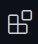

# Aký je to Pokémon?

(inštalácia prostredia)

V tomto dokumente sa nachádzajú pokyny, ako sa na workshop pripraviť a čo si nainštalovať na svoj laptop ešte pred príchodom na workshop.

Pre potreby workshopu si prosím nainštalujte:

* jazyk [Python](https://www.python.org/), ideálne v najnovšej verzii (v dobe písania tohto návodu je aktuálna verzia 3.11), a
* vývojové prostredie [Visual Studio Code]

Nižšie nájdete pokyny pre inštaláciu pre váš operačný systém.


## Inštalácia na Windows OS

Odporúčam vám inštalovať potrebný softvér pomocou balíčkovacieho systému [Chocolatey]:

* ako administrátor si nainštalujte balíčkovací systém [Chocolatey] podľa pokynov z [tejto stránky](https://chocolatey.org/install)

* pre nainštalovanie IDE [Visual Studio Code] s interpreterom Python napíšte v príkazovom riadku (ako admin) tento príkaz:

   ```bash
   $ choco install -y python3 vscode
   ```

Samozrejme si však oba balíčky môžete nainštalovať aj ručne:

* stiahnite si inštalátor jazyka Python pre svoj OS Windows z adresy https://www.python.org/downloads/ a pri inštalácii **zaškrtnite** možnosť pridať záznam do premennej `PATH`

* inštalátor prostredia [Visual Studio Code] stiahnete z domovskej stránky projektu https://code.visualstudio.com/


## Inštalácia na Linux OS
Jazyk Python sa už nachádza v OS Linux predinštalovaný. Overte si len to, či máte vhodnú verziu príkazom:

```bash
$ python3 --version
```

Vývojové prostredie [Visual Studio Code] môžete do svojej distribúcie nainštalovať aj pomocou balíčkov. Túto možnosť si ale overte vo svojej vlastnej distribúcii. V opačnom prípade na inštaláciu použite balíčky z domovskej stránky projektu.


## Inštalácia rozšírení pre VS Code

Aby sme mohli pracovať vo VS Code v jazyku Python, potrebujeme ešte nainštalovať niekoľko rozšírení. Tie nainštalujete kliknutím na tlačidlo `Extensions`:



Následne vyhľadajte a nainštalujte tieto rozšírenia:

* [Pylance](https://marketplace.visualstudio.com/items?itemName=ms-python.vscode-pylance)
* [Python Indent](https://marketplace.visualstudio.com/items?itemName=KevinRose.vsc-python-indent)
* [EditorConfig for VS Code](https://marketplace.visualstudio.com/items?itemName=EditorConfig.EditorConfig)


## Inštalácia projektu na OS Windows

1. Zo stránky https://github.com/namakanyden/workshop-pokedex si tiahnite priečinok `app-template/`. Ideálne si ho u seba uložte napr. na plochu, aby ste ho nemali ďaleko. Priečinok u seba premenujte napr. na `pokedex`.

2. Stlačte nad priečinkom `pokedex` pravé tlačidlo myši a vyberte položku `Open with Code`. Tým sa vám rovno spustí prostredie [Visual Studio Code] s uvedeným priečinkom. Pri otváraní už len potvrďte, že dôverujete obsahu priečinka.

3. V prostredí [Visual Studio Code] spustite príkazový riadok (menu `Terminal > New Terimnal`). V spodnej časti obrazovky sa vám spustí terminál

4. V príkazovom riadku zadajte nasledujúci príkaz:

   ```bash
   $ python3 -m venv venv
   ```

   Výsledkom príkazu bude, že v projekte sa vám vytvorí nový priečinok s názvom `venv/`. Okrem toho v pravom dolnom rohu sa zobrazí okno s informáciou, že VS Code zistilo, že sme vytvorili nové virtuálne prostredie a či ho chceme aktivovať. Potvrdíme, že áno.

6. Vypnite terminál a spustite nový. Aktuálne by mal riadok vyzerať v tvare:

   ```bash
   (venv) $
   ```

   Reťazec `venv` hovorí o tom, že používame virtuálne prostredie.

6. Aktuálne už zostáva len nainštalovať potrebné knižnice. To zabezpečíme spustením príkazu:

   ```bash
   (venv) $ pip install -r requirements.txt
   ```

7. Úspešnosť inštalácie overíme spustením demo aplikácie. Do príkazového riadku stačí napísať príkaz:

   ```bash
   (venv) $ python3 main.py
   ```

   Ak ste postupovali správne, v termináli sa vám zobrazí, že aplikácia počúva na porte `8000` (http://0.0.0.0:8000). Spustite prehliadač na adrese http://localhost:8000. Ak je všetko v poriadku, v prehliadači uvidíte reťazec:

   ```json
   "Hello world!"
   ```


[Chocolatey]: https://chocolatey.org/
[Visual Studio Code]: https://code.visualstudio.com/

