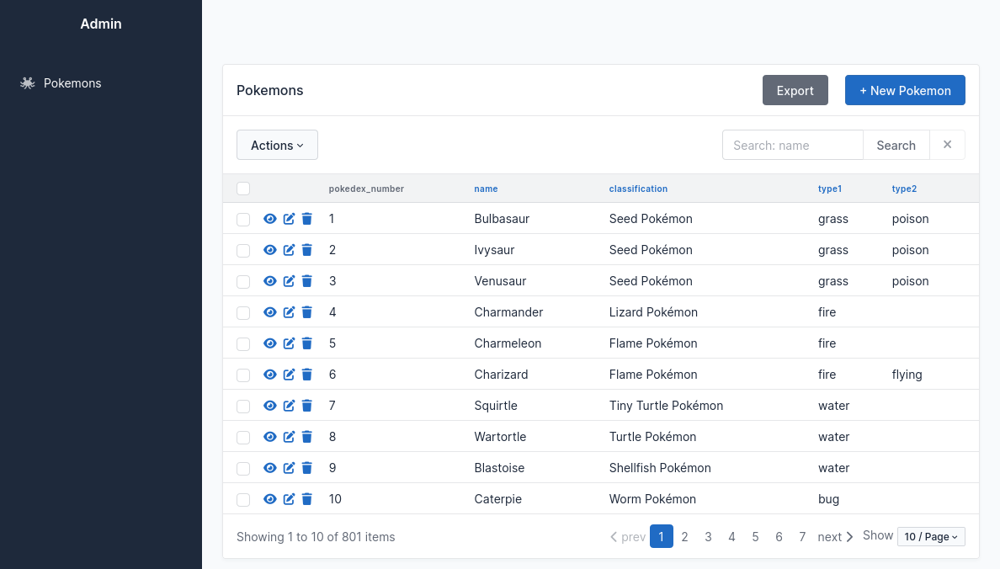
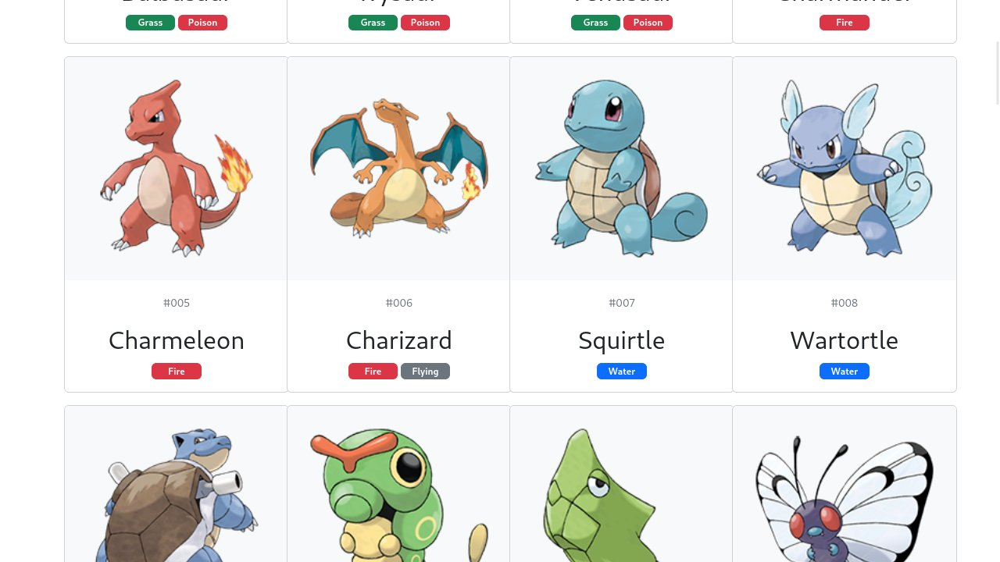

# Aký je to Pokémon?

alebo ako si vytvoriť [Pokédex](https://www.pokemon.com/us/pokedex/) v jazyku [Python](https://www.python.org/) pomocou webového rámca [FastAPI](https://fastapi.tiangolo.com/).


Pokédex je pomôcka každého správneho trénera Pokémonov. Ak si trénerom Pokémonov, už určite svoj Pokédex máš. To ale nevadí, pretože na tomto workshope si vytvoríš svoj vlastný Pokédex, ktorý môže vyzerať a fungovať ako len chceš.

Pokédex vytvoríme pomocou mladého a stále [populárnejšieho](https://survey.stackoverflow.co/2022/#most-loved-dreaded-and-wanted-webframe-love-dread) mikro webového rámca [FastAPI](https://fastapi.tiangolo.com). Keďže je primárne určený na tvorbu REST API, začneme endpoint-mi na získanie zoznamu všetkých Pokémonov, ale rovnako vytvoríme endpoint na získanie informácií o konkrétnom Pokémonovi na základe jeho čísla v Pokédexe. Ukážeme si však aj to, ako pomocou rámca FastAPI vytvárať dynamické HTML stránky pomocou šablónovacieho systému [Jinja](https://jinja.palletsprojects.com/). A samozrejme - dáta o Pokémonoch sú uložené v SQLite databáze a budeme k nim pristupovať pomocou balíka [SQLModel](https://sqlmodel.tiangolo.com).

**Odporúčaný čas:** 120 až 180 minút

**Upozornenie:** Keďže je tento workshop pomerne krátky, nebudeme v ňom vedieť aplikovať tie najlepšie prístupy pre tvorbu aplikácií pomocou rámca FastAPI.

## Ciele

1. Naučiť sa základy práce s webovým rámcom [FastAPI](https://fastapi.tiangolo.com/).
2. Naučiť sa vytvárať jednoduché modely pomocou rámca [SQLModel](https://sqlmodel.tiangolo.com/).
3. Naučiť sa vytvárať dopyty pomocou ORM rámca [SQLModel](https://sqlmodel.tiangolo.com/).
4. Naučiť sa vytvárať jednoduché REST API.
5. Naučiť sa vytvárať jednoduché HTML pohľady pomocou šablónovacieho systému [Jinja](https://jinja.palletsprojects.com/).


## Krok 1. Čo budeme potrebovať?

Ešte predtým, ako sa pustíme do tvorby aplikácie, si pripravíme prostredie pre prácu. Konkrétne budeme potrebovať:

* editor kódu jazyka Python (je možné použiť aj  [Thonny](https://thonny.org), ale odporúčam IDE, ktoré zvláda prácu s viacerými súbormi a nemá problém s automatickým dopĺňaním kódu)
* stiahnutú kostru projektu z priečinku `app-template/`
* nainštalované balíčky zo súboru `requirements.txt`


## Krok 2. Hello world!

[](https://fastapi.tiangolo.com/)

**Úloha 2.1** Otvorte v editore kódu súbor `main.py`

```python
from fastapi import FastAPI
import uvicorn


app = FastAPI(title="Pokédex")


@app.get("/")
def hello():
    return "Hello world!"


if __name__ == "__main__":
    uvicorn.run(
        "main:app",
        port=8080,       # port, na ktorom sa aplikácia spustí, default=8000
        host="0.0.0.0",  # bude akceptovať komunikáciu z akejkoľvek IP adresy, default=127.0.0.1
        reload=True,     # v prípade zmeny súboru sa aplikácia automaticky reštartne, default=False
    )
```

Pri spúšťaní sme zabezpečili, že:

* aplikácia bude prístupná na porte `8080`; parameter `port` nie je povinný a ak by sme ho neuviedli, aplikácia sa spustí na porte `8000`
* aplikácia bude akceptovať spojenia z akejkoľvek IP adresy (parameter `host=0.0.0.0`); parameter `host` nie je povinný a ak by sme ho neuviedli, bude možné k aplikácii pristupovať len z IP adresy `127.0.0.1`
* v prípade, že urobíme zmenu v ktoromkoľvek súbore, aplikácia sa sama aktualizuje; parameter `reload` nie je povinný a ak by sme ho neuviedli, bude mať nastavenú hodnotu `False`

**Poznámka:** Ak budete pre vývoj používať ľahký editor kódu [Thonny](https://thonny.org), tak **program nevypínajte stlačením červeného tlačidla**! Program totiž zostane bežať na pozadí a pri pokuse o jeho opätovné spustenie dostanete chybovú hlášku o tom, že port je už obsadený. To isté sa stane aj vtedy, ak omylom stlačíte tlačidlo spustiť, keď je program už spustený. Rýchlym riešením v rámci workshop-u je číslo portu zmeniť na iný.

**Poznámka pre inštruktora:** Pretože čas je najväčší nepriateľ tohto workshopu a ak nepoužívate niektoré z veľkých prostredí, ako napr. [VS Code](https://code.visualstudio.com) alebo [PyCharm](https://www.jetbrains.com/pycharm/), do modulu `main.py` môžete vložiť všetky potrebné importy pre celú aplikáciu už teraz. Toto vám ušetrí čas a nebudete musieť zmätočne behať hore a dolu v kóde vždy, keď začnete používať novú funkciu. Miesto toho môžete akurát upozorniť, z ktorého modulu bola importovaná. Ak však budete pre vývoj používať profesionálne vývojové prostredie, nie je potrebné vymenovať všetky importy dopredu - tieto prostredia budú v pravý čas vedieť správny modul importovať samé.

Zoznam všetkých potrebných systémových importov sa nachádza v tomto fragmente:

```python
import uvicorn
from fastapi import FastAPI, HTTPException, Request
from fastapi.responses import HTMLResponse
from fastapi.staticfiles import StaticFiles
from fastapi.templating import Jinja2Templates
from sqlmodel import create_engine, select, Session, or_
from sqladmin import Admin
```

**Úloha 2.2** Spustite a overte spustenú aplikáciu.

Po spustení bude aplikácia dostupná na adrese [http://0.0.0.0:8080](http://0.0.0.0:8080), resp. na adrese [http://localhost:8080](http://localhost:8080), ktorú budeme používať aj my. Ak otvoríme prehliadač na tejto adrese, uvidíme v ňom text:

```
Hello world!
```

**Lektor:** Viac nám však povie pohľad na hlavičku HTTP odpovede. Tú si vieme zobraziť napríklad nástrojom [`httpie`](https://httpie.io/) z príkazového riadku spustením príkazu:

```bash
$ http http://localhost:8080
```

Výsledkom bude HTTP hlavička odpovede spolu s jej telom:

```http
HTTP/1.1 200 OK
content-length: 14
content-type: application/json
date: Sat, 03 Sep 2022 20:50:08 GMT
server: uvicorn

"Hello world!"
```

Ako je možné vidieť, typ odpovede (kľúč `content-type` v hlavičke odpovede) je v tomto prípade JSON dokument (hodnota `application/json`) a nie HTML dokument, ako je tomu napríklad v prípade mikro webového rámca [Flask](https://flask.palletsprojects.com/) alebo [Django](https://www.djangoproject.com/). To je dané tým, že rámec FastAPI je primárne určený na tvorbu HTTP REST API.

A práve vytvorením jednoduchého HTTP REST API budeme pokračovať.


## Krok 3. Modelujeme Pokémona

Naša aplikácia bude pracovať s perzistentnými údajmi. Tie sa nachádzajú uložené v súbore `pokedex.sqlite`. Databáza obsahuje všetkých _801_ aktuálne známych Pokémonov. Zdrojom dát je dataset zverejnený na serveri [Kaggle](https://www.kaggle.com/datasets/rounakbanik/pokemon). Na komunikáciu s databázou SQLite budeme používať rámec [SQLModel](https://sqlmodel.tiangolo.com/).

[](https://sqlmodel.tiangolo.com/)

**Lektor:** Bližšie sa na uložených Pokémonov môžeme pozrieť pomocou SQLite klienta [`litecli`](https://litecli.com/). Databázu otvoríme príkazom:

```bash
$ litecli pokedex.sqlite
```

V databáze sa nachádza len jedna tabuľka. To si môžeme overiť príkazom:

```bash
pokedex.sqlite> .tables
```

Schému tabuľky si zobrazíme príkazom:

```bash
pokedex.sqlite> .schema pokemon
```

**Úloha 3.1** V koreňovom priečinku aplikácie vytvorte súbor `models.py`.

Do tohto súboru zapíšeme modely, ktoré budeme vytvárať. V našom prípade budeme pracovať len s jedným modelom, ktorým opíšeme Pokémona.

**Poznámka:** Pre väčšie projekty je však výhodnejšie vytvoriť samostatný balík (package) s názvom `models` a každý model do neho uložiť ako samostatný modul (súbor).

**Úloha 3.2** Vytvorte triedu `Pokemon`, ktorá bude potomkom triedy `SQLModel` a bude reprezentovať model Pokémona.


Model bude mať len základné vlastnosti (zatiaľ):

* `id` - primárny kľúč záznamu
* `name` - meno Pokémona
* `pokedex_number` - číslo Pokémona v Pokédex-e
* `classification` - klasifikácia / zaradenie Pokémona
* `type1` - typ Pokémona
* `type2` - typ Pokémona

```python
from sqlmodel import Field, SQLModel


class Pokemon(SQLModel, table=True):
    id: int | None = Field(default=None, primary_key=True)
    name: str
    pokedex_number: int
    classification: str
    type1: str
    type2: str
```

Pri čítaní a zapisovaní do databázy bude automaticky pracovať s tabuľkou s názvom `pokemon`. V prípade, že by sme potrebovali inú tabuľku, môžeme do modelu pridať atribút `__tablename__` s názvom požadovanej tabuľky, napr.:

```python
__tablename__ = "pokemon"
```


## Krok 4. Admin rozhranie

Ak chceme pracovať s údajmi uloženými v databáze, musíme sa k databáze pripojiť z našej aplikácie. V tomto kroku preto vytvoríme spojenie s databázou spolu s admin rozhraním z modulu [SQLAlchemy Admin](https://github.com/aminalaee/sqladmin).


**Úloha 4.1** Vytvorte spojenie s databázou.

Na začiatok súboru `main.py` vytvoríme premennú `engine`, pomocou ktorej sa budeme vedieť spojiť s databázou.

Do súboru `main.py` Vložíme nasledovný fragment kódu:

```python
from sqlmodel import create_engine

# db engine
engine = create_engine('sqlite:///pokedex.sqlite')
```


**Úloha 4.2** Vytvorte rozhranie pre administrátora pomocou modulu `sqladmin`.

Admin rozhranie vytvoríme veľmi jednoducho: pod riadok, v ktorom sme vytvorili objek `engine` vytvoríme admin rozhranie riadokm:

```python
from sqladmin import Admin

engine = create_engine("sqlite:///pokedex.sqlite")
admin = Admin(app, engine)
```


**Úloha 4.3** Overte funkčnosť admin rozhrania otvorením adresy [http://localhost:8080/admin/](http://localhost:8080/admin/) v prehliadači.

Pokiaľ je všetko v poriadku, v prehliadači sa vám zobrazí prázdna obrazovka admin rozhrania.


**Úloha 4.4** Vytvorte model pre zobrazenie Pokémonov v admin rozhraní.

V admin rozhraní zatiaľ nič nevidíme. Aby sme v ňom mohli vidieť Pokémonov z databázy, musíme pre ne vytvoriť samostatný model. Do súboru s modelmi preto vytvoríme nový model, ktorým opíšeme, čo a ako sa má v admin rozhraní zobrazovať.

Model nazveme `PokemonAdmin`, bude potomkom triedy `ModelView` a bude opisovať admin rozhranie modelu `Pokemon`. Kód bude vyzerať napríklad takto:

```python
from sqladmin import ModelView

class PokemonAdmin(ModelView, model=Pokemon):
    page_size = 20
    icon = "fa-solid fa-spaghetti-monster-flying"
    column_searchable_list = [Pokemon.name]
    column_sortable_list = [Pokemon.name, Pokemon.classification, Pokemon.type1, Pokemon.type2]
    column_list = [
        Pokemon.pokedex_number,
        Pokemon.name,
        Pokemon.classification,
        Pokemon.type1,
        Pokemon.type2
    ]
```

**Poznámka:** Možnosti konfigurácie zobrazenia modelu v admin rozhraní sú široké. O všetkých možnostiach sa dozviete na [stránkach dokumentácie modulu](https://aminalaee.dev/sqladmin/configurations/).


**Úloha 4.5** Pridajte model `PokemonAdmin` do admin rozhrania.

Aby sme v admin rozhraní videli našich Pokémonov z databázy, musíme náš model `PokemonAdmin` pridať do `admin` objektu. To urobíme v súbore `main.py`:

```python
from models import PokemonAdmin

engine = create_engine("sqlite:///pokedex.sqlite")
admin = Admin(app, engine)
admin.add_view(PokemonAdmin)
```

Ak teraz otvoríte prehliadač na adrese [http://localhost:8080/admin/], uvidíte v bočnom stĺpci názov nášho modelu. Ak naň kliknete, uvidíte zoznam všetkých Pokémonov, ktorých máme v databáze.



**Poznámka pre inštruktora:** Posledné dve úlohy odporúčam kombinovať. Začať len s premennou `column_list`, ktorá zobrazí príslušné stĺpce o Pokémonovi a následne pridávať a modifikovať ostatné premenné modelu `PokemonAdmin`. A samozrejme bez nutnosti reštartovať aplikáciu - vždy stačí admin rozhranie len obnoviť v prehliadači.


## Krok 5. Získanie zoznamu všetkých Pokémonov

V prípade, že klient vytvorí HTTP dopyt na endpoint `/api/pokemons`, v odpovedi dostane zoznam Pokémonov.


**Úloha 5.1** Vytvorte funkciu `get_pokemon_list()`, ktorá vráti (zatiaľ) prázdny zoznam Pokémonov.

```python
@app.get("/api/pokemons")
def get_pokemon_list():
    return []
```


**Úloha 5.2** Overte vytvorený endpoint.

Program aplikácie nie je potrebné zastavovať a znovu spúšťať. Stačí len spustiť HTTP klienta na adrese [`http://localhost:8080/api/pokemons`](http://localhost:8080/api/pokemons):

```bash
$ http http://localhost:8080/api/pokemons
```

Výsledkom bude prázdny zoznam.

```http
HTTP/1.1 200 OK
content-length: 2
content-type: application/json
date: Sat, 03 Sep 2022 23:02:12 GMT
server: uvicorn

[]
```


**Úloha 5.3** Upravte pohľad pre endpoint `/api/pokemons` tak, aby miesto prázdneho zoznamu vrátil zoznam všetkých Pokémonov, ktorí sa nachádzajú v databáze.

V jazyku SQL by sme zoznam všetkých Pokémonov získali príkazom

```sql
SELECT * FROM pokemon;
```

Tento príkaz vieme prepísať do jazyka Python pomocou ORM príkazov, ktoré poskytuje rámec SQLModel. Tým pádom miesto kurzoru, z ktorého musíme výsledky vytiahnuť a ručne z nich spraviť objekty typu `Pokemon` vo výsledku rovno dostanem zoznam týchto objektov.

Zodpovedajúci zápis bude vyzerať takto:

```python
from sqlmodel import select

from models import Pokemon

# SELECT * FROM pokemon;
statement = select(Pokemon)
```

Aby sme ho však spojazdnili, potrebujeme otvoriť spojenie s databázou a po vykonaní príkazu ho zasa zatvoriť. Na to vytvoríme objekt typu `Session` a využijeme na to _context provider_. Výsledný pohľad bude vyzerať nasledovne:

```python
@app.get("/api/pokemons")
def get_pokemon_list():
    with Session(engine) as session:
        statement = select(Pokemon)
        pokemons = session.exec(statement).all()
        return pokemons
```

Nie je však vždy veľmi praktické vracať zoznam úplne všetkých položiek, ktorých môžu byť tisíce až milióny. Zoznam výsledkov obmedzíme na _50_. V podstate urobíme niečo, čo by sme v jazyku SQL zapísali ako:

```sql
SELECT * FROM pokemon LIMIT 50;
```

Výsledná podoba pohľadu bude teda vyzerať takto:

```python
@app.get("/api/pokemons")
def get_pokemon_list():
    with Session(engine) as session:
        statement = select(Pokemon).limit(50)
        pokemons = session.exec(statement).all()
        return pokemons
```

**Poznámka:** Tento problém sa zvykne riešiť pomocou **stránkovania**. Stránkovanie si je možné vytvoriť ručne alebo je možné použiť existujúci modul [FastAPI Pagination](https://uriyyo-fastapi-pagination.netlify.app/).


## Krok 6. Získanie detailu o konkrétnom Pokémonovi

Na získanie detailov o konkrétnom Pokémonovi vytvoríme endpoint s parametrom `/api/pokemons/{pokedex_number}`, ktorý vráti JSON dokument s príslušnými detailami. Za týmto účelom vytvoríme nový pohľad, ktorý bude reprezentovaný novou funkciou.


**Úloha 6.1** Vytvorte funkciu `get_pokemon_detail()`, ktorá vráti (zatiaľ) prázdny JSON dokument.

Funkcia bude mať tieto parametre:

* `pokedex_number` - identifikačné číslo Pokémona v Pokédexe

```python
@app.get("/api/pokemons/{pokedex_number}")
def get_pokemon_detail(pokedex_number: int):
    return {}
```


**Úloha 6.2** Otestujte vytvorený pohľad.

Ak vytvoríme požiadavku s korektnou cestou, v odpovedi dostaneme prázdny JSON dokument. Napríklad:

```bash
$ http http://localhost:8080/api/pokemons/1
```

Ak však miesto celočíselného identifikátora použijeme iný údajový typ, dostaneme pekné chybové hlásenie. Ak sa napríklad miesto číselného identifikátora budeme pýtať na reťazec `pikatchu`:

```bash
$ http http://localhost:8080/api/pokemons/pikatchu
```
Výsledkom bude chyba:

```http
HTTP/1.1 422 Unprocessable Entity
content-length: 111
content-type: application/json
date: Sun, 04 Sep 2022 00:39:50 GMT
server: uvicorn

{
    "detail": [
        {
            "loc": [
                "path",
                "pokedex_number"
            ],
            "msg": "value is not a valid integer",
            "type": "type_error.integer"
        }
    ]
}
```


**Úloha 6.3** Upravte pohľad pre endpoint `/api/pokemons/{pokedex_number}` tak, aby miesto prázdneho JSON objektu vrátil  objekt s dátami o príslušnom Pokémonovi.

V jazyku SQL by sme detaily o Pokémonovi s číslom v Pokédexe _25_ získali príkazom

```sql
SELECT *
FROM pokemon
WHERE pokedex_number=1;
```

Tento SQL príkaz prepíšeme do jazyka Python pomocou ORM takto:

```python
# SELECT * FROM pokemon WHERE pokedex_number=1;;
statement = select(Pokemon).where(Pokemon.pokedex_number == pokedex_number)
```

Nakoniec už len aktualizujeme pohľad podobne, ako tomu bolo pri získaní zoznamu Pokémonov:

```python
@app.get("/api/pokemons/{pokedex_number}")
def get_pokemon_detail(pokedex_number: int):
    with Session(engine) as session:
        statement = select(Pokemon).where(Pokemon.pokedex_number == pokedex_number)
        pokemon = session.exec(statement).one()
        return pokemon
```


**Úloha 6.4** Overte správnosť vašej implementácie.

Ak napríklad požiadate o detaily Pokémona s identifikačným číslom v Pokédexe _42_:

```bash
$ http http://localhost:8080/api/pokemons/42
```

dostaneme v odpovedi objekt s informáciami o Pokémonovi s menom _Golbat_:

```http
HTTP/1.1 200 OK
content-length: 77
content-type: application/json
date: Sun, 04 Sep 2022 00:56:06 GMT
server: uvicorn

{
    "classification": "Bat Pokémon",
    "id": 42,
    "name": "Golbat",
    "pokedex_number": 42,
    "type1": "poison",
    "type2": "flying"
}
```

Ak sa však opýtame na neexistujúceho Pokémona, napr. s číslom _999_, dostaneme v odpovedi HTTP status kód `500`:

```http
HTTP/1.1 500 Internal Server Error
content-length: 21
content-type: text/plain; charset=utf-8
date: Sun, 04 Sep 2022 00:57:42 GMT
server: uvicorn

Internal Server Error
```

čo nie je veľmi sexi :-(


**Úloha 6.5** Zabezpečte, aby v prípade, ak Pokémon s daným číslom neexistuje, mala HTTP odpoveď stavový kód `404`.

Riešiť tento problém môžeme v princípe dvoma spôsobmi:

1. zachytením vzniknutej výnimky `sqlalchemy.exc.NoResultFound`, alebo
2. miesto metódy `.one()`, ktorá v prípade, že výsledkom dopytu nie je práve jeden objekt, skončí s výnimkou, použijeme metódu `.one_or_none()`, ktorá vráti hodnotu `None`

V prípade druhého spôsobu bude upravený pohľad vyzerať takto:

```python
@app.get("/api/pokemons/{pokedex_number}")
def get_pokemon_detail(pokedex_number: int):
    with Session(engine) as session:
        statement = select(Pokemon).where(Pokemon.pokedex_number == pokedex_number)
        pokemon = session.exec(statement).one_or_none()
        if pokemon is None:
            raise HTTPException(status_code=404, detail="Pokemon not found.")
        return pokemon
```

## Krok 7. Automagická dokumentácia REST API

Pre vytvorené REST API rámec FastAPI automaticky generuje dokumentáciu v dvoch formátoch:

1. [Redoc](https://redocly.com/redoc/) - dostupný na adrese [http://localhost:8080/redoc](http://localhost:8080/redoc)
2. [OpenAPI/Swagger](https://swagger.io/) - dostupný na adrese [http://localhost:8080/docs](http://localhost:8080/docs)

Pre viac možností, ako je napríklad dokumentácia jednotlivých endpointov, sa pozrite na oficiálnu dokumntáciu rámca FastAPI.


## Krok 8. HTML pohľad pre domovskú stránku pomocou šablónovacieho systému Jinja


**Úloha 8.1** Zmeňte typ dokumentu odpovede pre cestu `/` na HTML.

Predvolene je typ výsledného dokumentu JSON. Ak chceme zmeniť typ dokumentu odpovede na HTML, do dekorátora funkcie ošetrujúcej cestu pridáme parameter `response_class=HTMLResponse` .

```python
from fastapi.responses import HTMLResponse

@app.get("/", response_class=HTMLResponse)
def hello():
    return "Hello world!"
```

Typ dokumentu uvidíme v hlavičke odpovede:

```http
HTTP/1.1 200 OK
content-length: 12
content-type: text/html; charset=utf-8
date: Sun, 04 Sep 2022 02:13:25 GMT
server: uvicorn

Hello world!
```


**Úloha 8.2** Inicializujte šablónovací systém Jinja pre použitie v aplikácii.

Potrebujeme inicializovať dve veci:

1. šablónovaciemu systému Jinja potrebujeme povedať, v ktorom priečinku sa nachádzajú šablóny stránok, a
2. povedať rámcu FastAPI, v ktorom priečinku sa budú nachádzať statické súbory (ako napr. obrázky, CSS štýly, JavaScript-y, a pod.)

```python
from pathlib import Path

from fastapi.staticfiles import StaticFiles
from fastapi.templating import Jinja2Templates
from fastapi.staticfiles import StaticFiles

app = FastAPI()
app.mount("/static",
          StaticFiles(directory=Path(__file__).parent / 'static'),
          name="static")
templates = Jinja2Templates(directory="templates")
```


**Úloha 8.3** Miesto textu `"Hello world!"` vráťte v odpovedi HTML stránku zo šablóny `homepage.tpl.html`.

Funkcii `get_homepage()` pridáme parameter `request`, ktorý je typu `Request`. Ten je potrebný pri skladaní šablóny šablónovacím systémom Jinja.

Funkcia bude tentokrát vracať objekt šablóny, ktorá má dva parametre:

1. názov súboru šablóny, ktorá má byť vrátená, a
2. slovník `context` obsahujúci údaje, ktoré sa majú v šablóne zobraziť; v našom prípade sa jedná o kľúče
   1. `request` - objekt požiadavky `request`, a
   2. `title` - názov webovej stránky

```python
from fastapi import Request

@app.get("/", response_class=HTMLResponse)
def hello(request: Request):
    context={
        'request': request,
        'title': 'Vitajte | Pokédex'
    }
    return templates.TemplateResponse('home.tpl.html', context)
```


**Úloha 8.4** Otestujte aktualizovaný pohľad.

Ak otvoríte adresu [http://localhost:8080/](http://localhost:8080/) vo webovom prehliadači, zobrazí sa obsah Jinja šablóny pre domovskú, resp. hlavnú stránku.


## Krok 9. Pokédex ako HTML stránka


**Úloha 9.1** Vytvorte funkciu `view_list_of_pokemons()`, pomocou ktorej zobrazíte webovú stránku Pokédex-u.

V podstate len zmodifikujeme funkciu `get_pokemon_list()` a zabezpečíme, aby miesto JSON dokumentu vrátila šablónu zo súboru `pokemon-list.tpl.html`. Do objektu kontextu akurát pridáme do kľúča `pokemons` zoznam výsledkov dopytu z databázy.

```python
@app.get('/pokedex', response_class=HTMLResponse)
def view_list_of_pokemons(request: Request):
    with Session(engine) as session:
        statement = select(Pokemon).limit(50)
        pokemons = session.exec(statement).all()

        context = {
            'request': request,
            'title': 'Všetci Pokémoni na jednom mieste | Pokédex',
            'pokemons': pokemons
        }

        return templates.TemplateResponse('pokemon-list.tpl.html', context)
```


**Úloha 9.2** Overte vytvorenú funkciu.

Ak otvoríte prehliadač na adrese [http://localhost:8080/pokedex](http://localhost:8080/pokedex), zobrazí sa vám _50_ prvých Pokémonov z Pokédexu.




## Krok 10. Detail Pokémona ako HTML stránka


**Úloha 10.1** Vytvorte funkciu `view_detail_of_pokemon()`, pomocou ktorej zobrazíte webovú stránku s detailami o konkrétnom Pokémonovi.

Opäť pôjde o modifikáciu funkcie `get_pokemon_detail()`, ktorá vráti informácie o Pokémonovi v podobe HTML dokumentu. Ak sa Pokémon nájde, funkcia vráti šablónu `pokemon-detail.tpl.html`. V opačnom prípade vráti šablónu `404.tpl.html`.

```python
@app.get("/pokedex/{pokedex_number}", response_class=HTMLResponse)
def view_detail_of_pokemon(request: Request, pokedex_number: int):
    with Session(engine) as session:
        statement = select(Pokemon).where(Pokemon.pokedex_number == pokedex_number)
        pokemon = session.exec(statement).one_or_none()
        if pokemon is None:
            context = {
                "request": request,
                "title": "Pokémon sa nenašiel | Pokédex"
            }
            return templates.TemplateResponse("404.tpl.html", context)

        context = {
            "request": request,
            "title": f"{pokemon.name} | Pokédex",
            "pokemon": pokemon,
        }

        return templates.TemplateResponse("pokemon-detail.tpl.html", context)
```


**Úloha 10.2** Overte vytvorenú funkciu.

Ak otvoríte prehliadač na adrese [http://localhost:8080/pokedex/25](http://localhost:8080/pokedex/25), zobrazia sa vám informácie o Pokémonovi _Pikatchu_.

## Krok 10. Vyhľadávač Pokémonov

**Úloha 10.1** Rozšírte pohľad definovaný funkciou `view_list_of_pokemons()` o tzv. _query parameter_ `q`, ktorý pomocou ktorej zobrazíte webovú stránku s detailami o konkrétnom Pokémonovi.

```python
from sqlmodel import or_

@app.get('/pokedex', response_class=HTMLResponse)
def view_list_of_pokemons(request: Request, q: str | None = None):
    with Session(engine) as session:
        if q is None:
            statement = select(Pokemon).limit(40)
        else:
            statement = (
                select(Pokemon)
                .where(or_(Pokemon.name.ilike(f'%{q}%'), Pokemon.id == q))
                .limit(40)
            )
        pokemons = session.exec(statement).all()

        context = {
            'request': request,
            'title': 'Výsledky hľadania | Pokédex',
            'pokemons': pokemons
        }

        return templates.TemplateResponse('pokemon-list.tpl.html', context)
```


## Ďalšie zdroje

* [Pokédex](https://www.pokemon.com/us/pokedex/) - online pomôcka každého správneho lovca Pokémonov
* [FastAPI](https://fastapi.tiangolo.com/) - mikro webový rámec jazyka Python
* [SQLModel](https://sqlmodel.tiangolo.com/) - knižnica pre interakciu s SQL databázami s objektami v jazyku Python
* [SQLAdmin](https://aminalaee.dev/sqladmin/) - admin rozhranie pre modely napísané pomocou knižnice *SQLModel*
* [Jinja](https://jinja.palletsprojects.com) - šablónovací systém
* Real Python: [Build a URL Shortener With FastAPI and Python](https://realpython.com/build-a-python-url-shortener-with-fastapi/) - návod, ako vytvoriť skračovať adries v štýle [bit.ly](https://bitly.com) pomocou mikro webového rámca FastAPI
* Real Python: [Primer on Jinja Templating](https://realpython.com/primer-on-jinja-templating/) - návod, ako pracovať a používať šablónovací systém Jinja (v mikro webovom rámci Flask)
* [Namakané webináre](http://namakanyden.sk/webinare/): Tvorba dynamických webových stránok v jazyku Python, [časť 1](http://namakanyden.sk/webinars/2020.01-fastapi.i.html), [časť 2](http://namakanyden.sk/webinars/2020.02-fastapi.ii.html), [časť 3](http://namakanyden.sk/webinars/2020.03-fastapi.iii.html)


## Licencia

Uvedené dielo podlieha licencii [Creative Commons BY-NC-SA 4.0](https://creativecommons.org/licenses/by-nc-sa/4.0/deed.cs).
